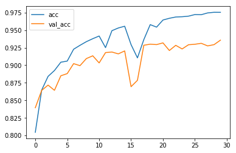
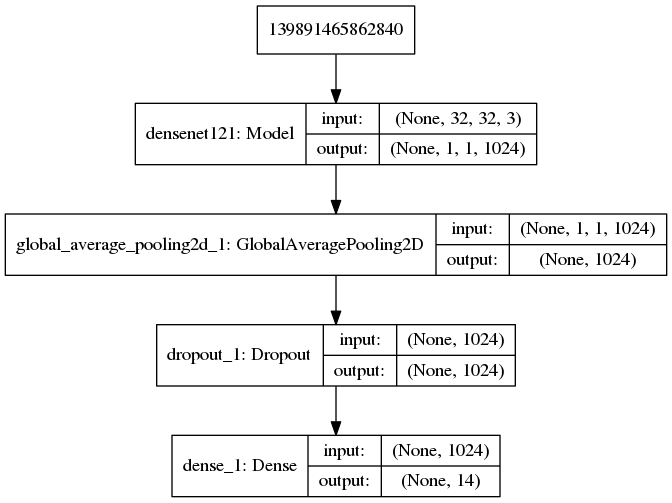

# Project Overview: iWildCam 2019 - FGVC6
In this project I use Keras and TensorFlow to do multi classification for wild animal images. I use Kaggles free GPUs and Datasets in this competion.

# The Data
https://www.kaggle.com/c/iwildcam-2019-fgvc6

The training set contains 196,157 images from 138 different locations in Southern California. 

The test set contains 153,730 images from 100 locations in Idaho.

# Used In This Project

1) Keras

2) TensorFlow

3) Transfer Learning

4) F1 Score

5) Keras Callbacks

